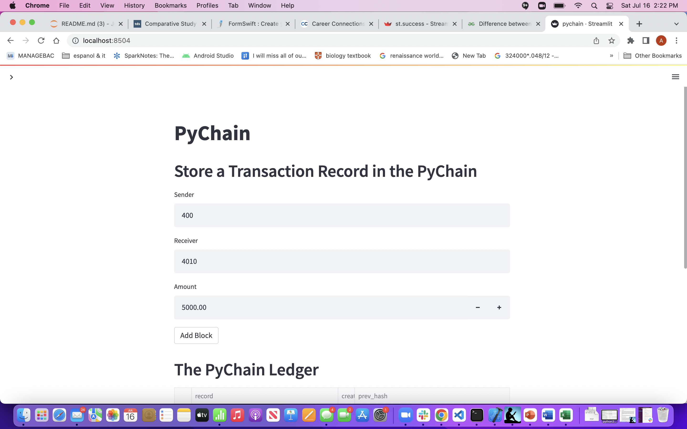
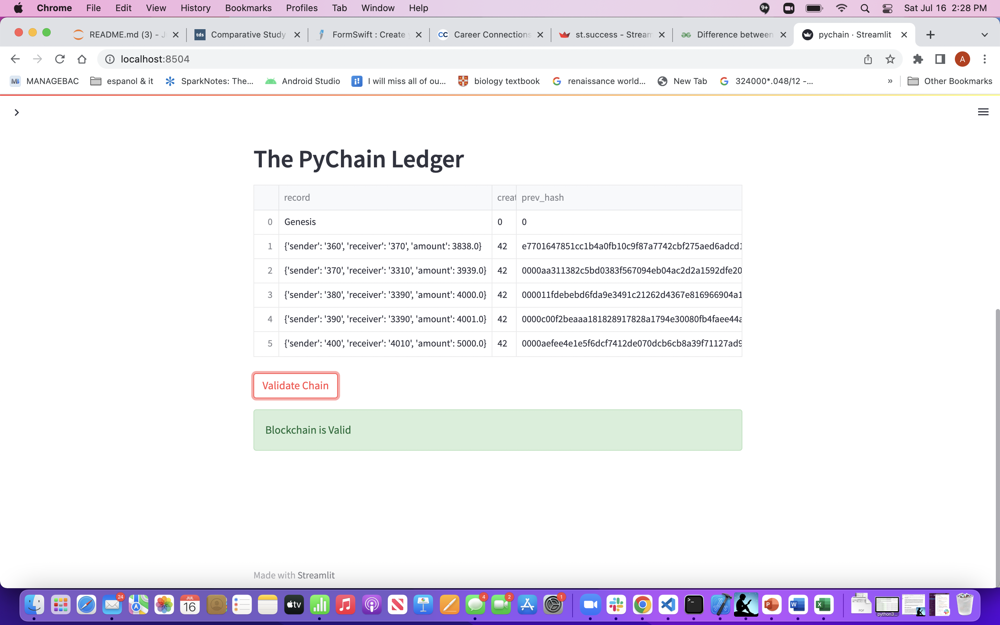
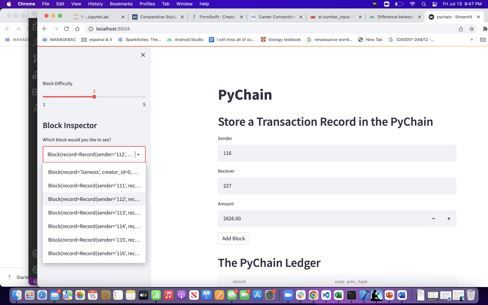
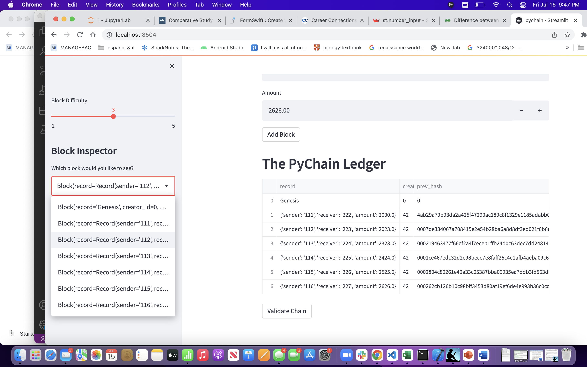
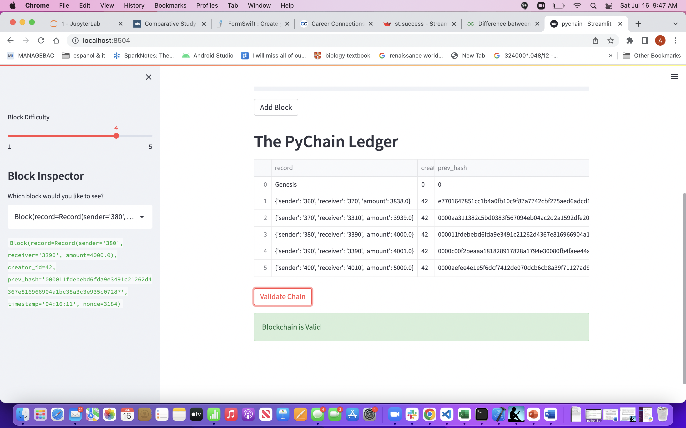
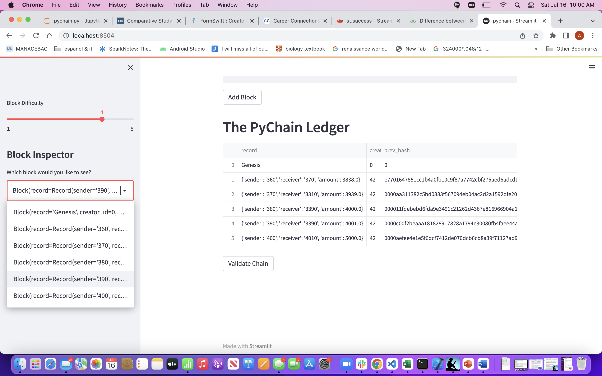
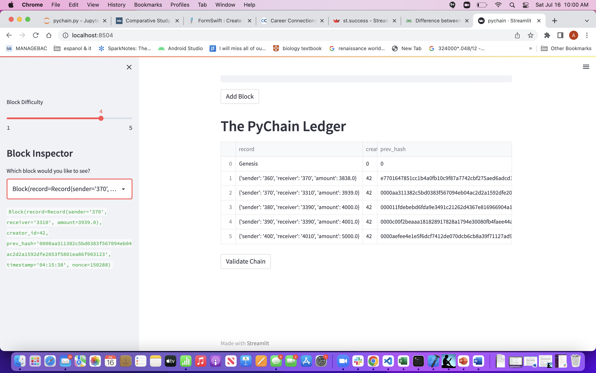

# Module-18-Challenge - Blockchain Based Ledger System
--- 

---
## User Story
As a lead developer on the decentralized finance team of one of the leading banks you are asked to build a blockchain-based ledger system, complete with a user-friendly web interface. This ledger should allow partner banks to conduct financial transactions (that is, to transfer money between senders and receivers) and to verify the integrity of the data in the ledger.

The Starter Code was provided to expedite the development process.

---
---
## Acceptance Criteria  

The `Starter Code` for the blockchain ledger application must be modified to meet the following criteria:

* Define a `Record` Data Class with the following attributes:
    - `sender` of type `str`
    - `receiver` of type `str`
    - `amount` of type `float`
* Modify the `Block` data class to use the `Record` Data Class
* Modify the Streamlit interface to accept inputs from the user:
    - `sender` id
    - `receiver` id
    - `amount` to transfer
    - `Add Block` to add this data record to the ledger  

The `code` should accept the user inputs and store the transaction record in memory. After adding several records:
* it should be able to verify the contents of the `blocks` of transactions and their respective `hashes` using the `Streamlit sidebar` drop-down menu
* it should be able to verify the validity of the `Blockchain` using the web-interface by clicking the `Validate Chain` button, which is provided in the Starter code.

---
---
## The Application

The Starter code was modified to:
* include the `Record` Data Class
    - @dataclass  
         class Record:  
            sender: str  
            receiver: str  
            amount: float  
            
* have the `Block` Data Class use the `Record` Data Class for storing the transaction record
    - @dataclass  
        class Block:
            record: Record
            creator_id: int
            prev_hash: str = "0"
            timestamp: str = datetime.datetime.utcnow().strftime("%H:%M:%S")
            nonce: int = 0  
       
* accept the user inputs for 
    - `sender` id
    - `receiver` id
    - `amount` to transfer
#### See the User Inputs Screenshot Below

* display the blockchain validity using Streamlit:
    - if `valid` display success message using `st.success` function. 
    - If `invalid`, display warning message using `st.warning` function.
#### See the Validity Success Message Screenshot below

---
---
## Testing the Ledger
The following screenshots display the data-entry fields, the transactions recorded, blocks verified using the drop-down menu and validity of the blockchain established by the application by displaying the success message after verifying the blockchain hash links.  

### Accepting and Storing the Transaction Data
  

### Display the Transaction Ledger 
  

### Validate the blockchain 

### Block Inspection Dropdown Menu

### Block Data Verification

---
---

## Technologies
The application is developed using:  
* Language: Python 3.7   
* Libraries: Pandas, Streamlit
* Development Environment: VS Code and Terminal, Anaconda 2.1.1 with conda 4.11.0, Jupyterlab 3.2.9
* OS: Mac OS 12.1

---
---

## Installation Guide
Before running the applications open your terminal to install the libraries and verify them. The following are instructions to install the libraries for the applications.  

* [python](https://www.python.org/downloads/) 
* [anaconda3](https://docs.anaconda.com/anaconda/install/windows/e) 
* [pandas](https://pandas.pydata.org/docs/getting_started/install.html)
* [streamlit](https://docs.streamlit.io/library/get-started/installation)

### Clone the application code from Github as follows:
copy the URL link of the application from its Github repository      
open the Terminal window and clone as follows:  

   1. %cd to_your_preferred_directory_where_you want_to_store_this_application  
    
   2. %git clone URL_link_that_was_copied_in_step_1_above   
    
   3. %ls       
        Module-18    
        
   4. %cd Module-18  

The entire application files in the current directory are as follows:

* Images              (screenshots used in README)
    - blk_inspection.png
    - blk_ledger.png
    - blk_store.png
    - blk_verify.png
    - user_inputs.png
    - valid_blkchain.png
    - validity_success.png    
* README.md
* Starter_Code         (Starter Code)
* pychain.py           (application code)
* `Pipfile`              `(Installed by Sreamlit installation process). Included for reference purpose ONLY`
* `Pipfile.lock`         `(Installed by Sreamlit installation process). Included for reference purpose ONLY`
    
---
---

## Usage
The following details the instructions on how to run the applications.  

### Setup the environment and Run the application 

Setup the environment using conda as follows:

    5. %conda create dev -python=3.7 anaconda  
    
    6. %conda activate dev  
    
### Setup Streamlit
Before running the app, please make sure that Streamlit is installed on your system and the libraries mentioned above are installed as well.

### Run the App

After step 6 of setting up the environment, follow these instructions:
    
     7. pipenv install streamlit
     8. streamlit run pychain.py
     
Follow the prompts to enter the user inputs, add the data record,  and validate the blockchain.

---
---

## Contributors 
Ashok Pandey - ashok.pragati@gmail.com, www.linkedin.com/in/ashok-pandey-a7201237  

---
---

## License
The source code is the property of the developer. The users can copy and use the code freely but the developer is not responsible for any liability arising out of the code and its derivatives.

---
---
